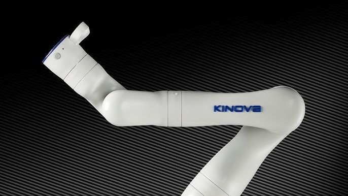

# Gen3 ROS 2 Joint Wrapper (Kinova Gen3)
<p align="center">
  
</p>

A minimal ROS 2 (Jazzy) Python wrapper for the Kinova Gen3 that exposes a compact joint–trajectory interface: `reset() → observe() → step()`. It subscribes to `/joint_states`, optionally to RGB topics, and publishes `trajectory_msgs/JointTrajectory` to your arm controller. Optional Robotiq gripper control is provided via the `control_msgs/GripperCommand` action.

---

## Requirements

* Ubuntu 24.04 with ROS 2 Jazzy
* Kinova Gen3 drivers/controllers running (joint trajectory controller active)
* Python ≥ 3.10 (use system Python with ROS sourced)
* Camera topics are optional

---

## Installation

```bash
git clone <repo-url> gen3_joint_wrapper
cd gen3_joint_wrapper
python3 -m venv .venv
source .venv/bin/activate
pip install -r requirements.txt
# optional: editable install for `from gen3_env import make`
pip install -e .
```

Source ROS in every shell where you run code:

```bash
source /opt/ros/jazzy/setup.bash
# and your workspace, if applicable:
# source ~/Research/workspace/gen3_ws/install/setup.bash
```

---

## Quickstart (joints only)

```python
import numpy as np
from gen3_env import make

env = make(
    env_id="gen3",
    control_mode="joint_trajectory",
    joint_states_topic="/joint_states",
    external_rgb_topic="/camera/color/image_raw",  # optional
    wrist_rgb_topic=None,
    joint_traj_topic="/joint_trajectory_controller/joint_trajectory",
    home_on_reset=False,
    rate_hz=15.0,
)

obs = env.reset()
q = obs.get("joint_position", np.zeros(7, dtype=np.float32))

# small move: nudge joint_2 and joint_4
target = q.copy()
target[1] += np.deg2rad(8.0)
target[3] -= np.deg2rad(8.0)

env.step(target.tolist(), seconds=2.0)
env.step(q.tolist(), seconds=2.0)  # back to original

env.close()
```

Gripper (optional):

```python
# send absolute setpoint in [gripper_min_pos, gripper_max_pos]
env.set_gripper(0.7)
env.open_gripper()
env.close_gripper()
```

---

## API

### Factory

```python
make(env_id="gen3", control_mode="joint_trajectory", **kwargs) -> Gen3Env
```

Key kwargs (selected):

* `joint_states_topic` (default `/joint_states`)
* `external_rgb_topic`, `wrist_rgb_topic` (optional)
* `joint_traj_topic` (default `/joint_trajectory_controller/joint_trajectory`)
* `joint_names` (7-DoF order)
* `home_on_reset`, `home_joint_positions`, `home_time_sec`
* `joint_step_limit` (per-step clamp), `rate_hz`
* `robotiq_action_name`, `gripper_min_pos`, `gripper_max_pos`, `gripper_default_effort`

### Env

* `reset() -> dict`
  Waits for initial data according to config and returns first observation.
* `observe() -> dict`
  Returns latest observation.
* `step(action: Sequence[float], seconds: Optional[float]) -> dict`
  Joint mode only. `action` length 7 = absolute joint targets. If `seconds` is provided, streams for that duration at `rate_hz`. Per-step deltas are clipped by `joint_step_limit` when current state is known.
* `open_gripper()`, `close_gripper()`, `set_gripper(position: float, max_effort: Optional[float] = None)`
  Sends `GripperCommand` action goal (non-blocking).
* `close()`
  Destroys the ROS node. Use `reopen()` to rebuild if needed.

### Observation keys (if available)

* `joint_position` `(7,) float32`
* `joint_velocity` `(7,) float32`
* `joint_effort` `(7,) float32`
* `rgb_external` `H×W×3 uint8` (optional)
* `rgb_wrist` `H×W×3 uint8` (optional)
* `gripper_commanded` `(1,) float32`

---

## Notes

* This wrapper does not manage controller lifecycles. Ensure your joint trajectory controller is running.
* Start with small angle changes and verify limits for your hardware and tooling.

---

## Troubleshooting

* Import errors for `rclpy` or ABI issues: run with system Python and source ROS (`/opt/ros/jazzy/setup.bash`). Avoid mixing Conda toolchains with ROS binaries.
* No images in observations: verify topics and set `external_rgb_topic`/`wrist_rgb_topic` to match `ros2 topic list`.
* Duplicate camera namespaces: ensure you do not double-namespace in your camera bring-up.

---

## Author

Anas Houssaini
McGill University | Kinova Robotics
